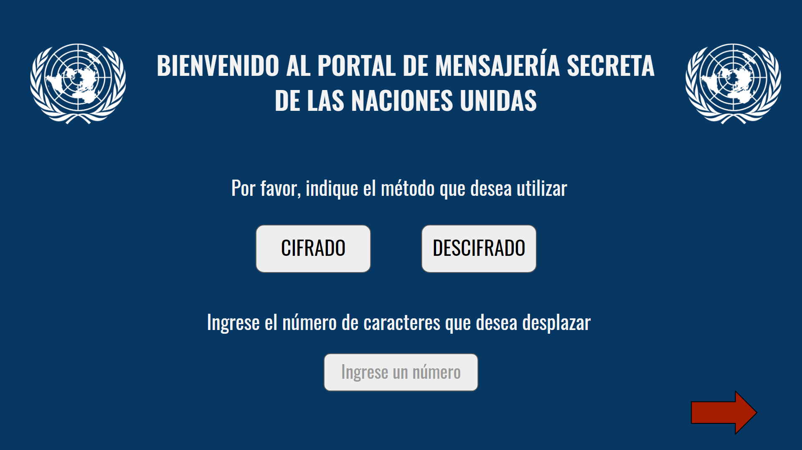
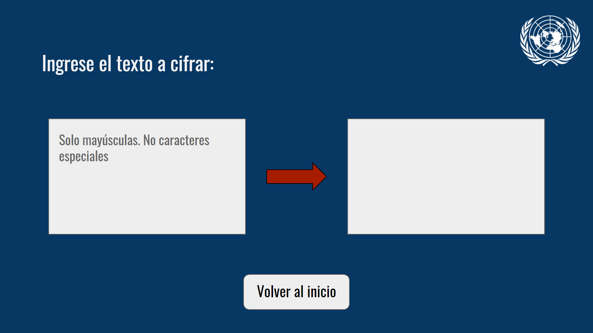
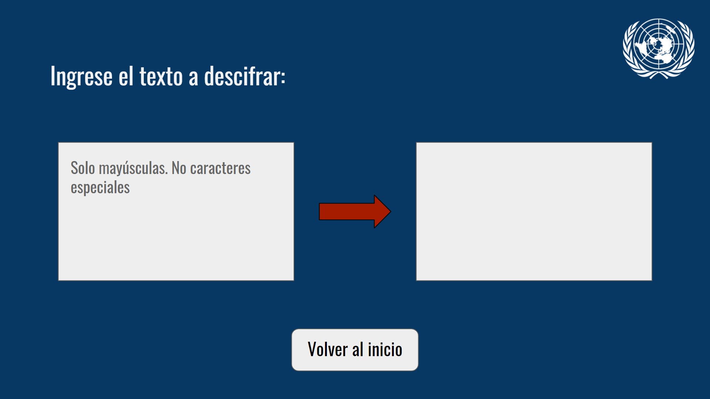
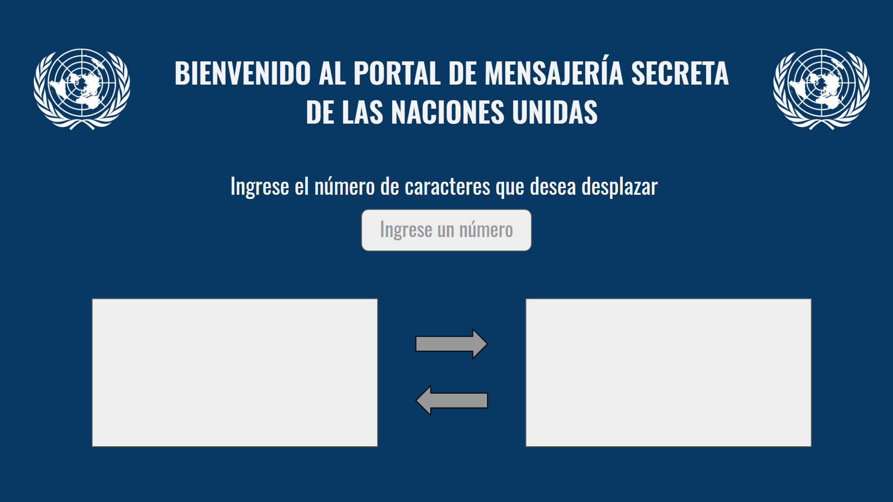
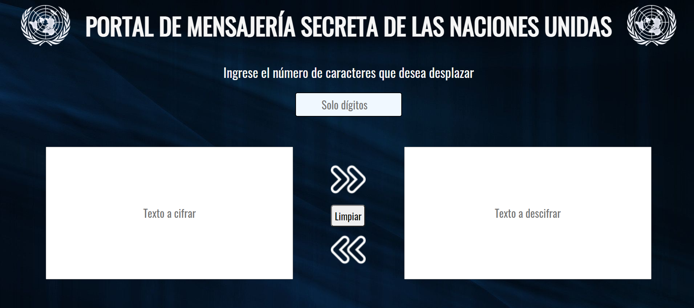

<h1> Introducción </h1>

<!-- introducción a la aplicación, su funcionalidad y decisiones de diseño.-->
El cifrado Cesar es uno de los primeros métodos de cifrados de la historia y por ende una de las técnicas más simples para codificar un mensaje por medio de la sustitución, donde cada letra del texto original es reemplazada por otra de acuerdo a la cantidad de desplazamientos que uno escoja.
Con la aplicación del Cifrado Cesar de las Naciones Unidas, las personas que tengan acceso podrán codificar o decodificar un mensaje introduciendo la cantidad de posiciones con las que desean que cada letra avance o retroceda. 
El principal objetivo es mantener los datos de suma importancia de forma secreta, para que terceros no puedan enterarse, sobre todo en el contexto de las guerras civiles en los países del medio oriente, donde hay misiones en las que las organizaciones de Derechos Humanos buscan disminuir poco a poco los conflictos hasta erradicarlos. 
Para el diseño, se escogió colores como el blanco y el azul por ser una organización seria, con íconos y cuadros sencillos pues la idea es enfocarnos en la funcionalidad del cifrado.

<h1> Instrucciones para el uso </h1>

La aplicación consta de una sola pantalla, en la cual vemos el logo y el título en el header de la página.
Nos piden que ingresemos el número de caracteres que queremos desplazar, espacio en donde solo se permite colocar dígitos. Podemos introducir el dato de forma manual o también podemos utilizar las flechitas ubicadas en el mismo espacio. 
Debajo, se muestran dos cuadros: 
- El de la izquierda es donde escribiremos el texto a cifrar.
- El de la derecha, donde escribiremos el texto a descifrar. 
También se muestran 3 elementos (2 flechas y un botón): 
- La flecha de arriba es la que mandará a codificar el texto y lo colocará en el recuadro de la derecha.
- La flecha de abajo es la que mandará a decodificar el texto y lo colocará en el recuadro de la izquierda.
- El botón "Limpiar" borrará los datos ingresados (en los recuadros y el número de caracteres).

<h1> Objetivos de aprendizaje logrados </h1>

En cuanto al HTML y CSS 
- Traté de usar el html5 lo más que pude, con la etiqueta 'section' en lugar de usar 'div'.
- Usé selectores para que me sea más accesible tanto el js como el css.
- Mi diseño es en un 95% igual a mi prototipo, debido a que mejoré ciertos detalles.

En cuanto al DOM
- Puedo decir que manipulo el DOM no al 100% pero voy aprendiendo qué utilizar para cada situación, aunque no todo lo he aplicado en este proyecto.

En cuanto a Javascript
- Utilicé condicionales (if), bucles (for) y funciones.
- Declaré las variables de forma correcta (const & let).

En cuanto a UX (definición del producto):
- Usuarios (objetivos y resolución de problemas): Escogí la situación de las organizaciones de DDHH en zonas de conflicto. Pensé en países como Siria o Yemén, que llevan muchos años con enfrentamientos por guerras civiles, causando perjuicios a la población, y por lo cual la ONU está en proceso de solucionar los conflictos para mitigar el sufrimiento de los pueblos. Quizás con un cifrado como este, los que trabajan en las organizaciones consigan comunicarse protegiendo los mensajes para que terceros no puedan leer la información que envían o reciben, que podrían ser datos de suma importancia para estas misiones. 
- Diseño: Sencillo y con colores serios por estar relacionado a la ONU. Debía llevar el logo de esta organización y solo lo necesario para la mensajería cifrada. 
- Prototipos y feedbacks: Hice un prototipo en Presentaciones de Google, procedí a pedir feedback y me recomendaron cambiar solo el color de la flecha para que se vea más notoria.
    Así quedó mi prototipo listo para pasar al código:
    
    
    
    Luego de intentar hacerlo de esta forma, una compañera me dio su feedback, comentándome que tal vez sería mejor si lo hiciera en una sola pantalla, con dos cuadros, así que diseñé otro prototipo (el cual volví a mostrar a mis familiares para que me dieran feedback), quedando listo para empezar a codificar: 
    
        Para darle más estilo, decidí colocarle unas flechas simples pero con estilo, y le agregué el botón limpiar. Así fue como quedó luego de codear: 
    